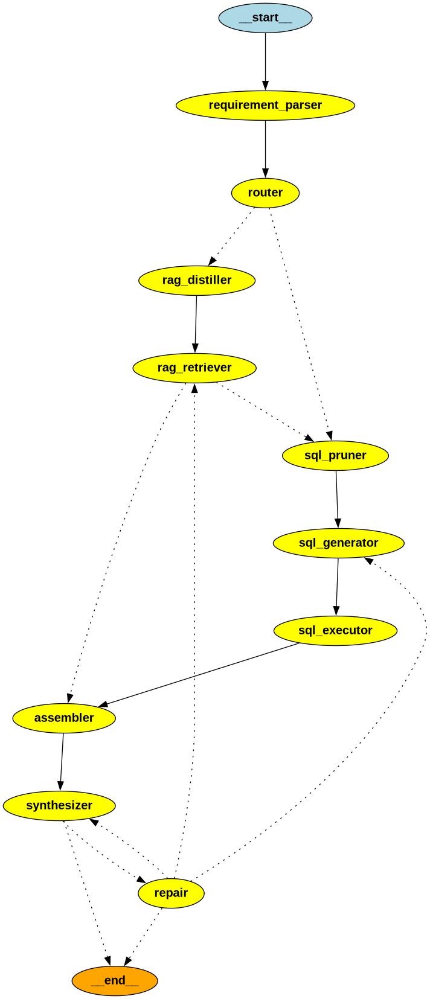

# Northwind AI Workflow



## Graph Design
- **Orchestrator Agent**: Requirement parser → router → assembler → synthesizer with repair loops
- **RAG Agent**: TF-IDF document retrieval with graph distillation for relevant chunk filtering
- **SQL Agent**: LLM-driven schema pruning → SQL generation → execution with query normalization
- **Hybrid Flow**: RAG distillation → retrieval → SQL pruning → generation → execution → synthesis

## DSPy Optimization
Optimized **SQLGenerator** module using JSON-prompting approach:
- **Before**: DSPy structured outputs with parsing issues
- **After**: Direct JSON schema prompting with robust extraction
- **Delta**: Improved SQL generation reliability and reduced parsing errors

## Trade-offs & Assumptions
- **Schema Pruning**: LLM-based pruning may over-include tables to avoid missing joins
- **Repair Strategy**: Limited to 2 repair attempts to prevent infinite loops
- **TF-IDF Retrieval**: Simple cosine similarity without semantic embeddings for faster processing

---

## Hybrid Agent Interactive Runner

A concise notebook to interactively test the hybrid agent workflow.

- Configure paths and model
- Initialize `HybridAgent`
- Run a single question
- (Optional) Run a small batch from a JSONL file

Keep outputs minimal per project constraints.

### Setup

```python
# Setup
from pathlib import Path
import sys, platform

# Absolute paths
ROOT = Path('/home/mohammed/Desktop/tech_projects/northwind_ai_workflow')
DB_PATH = ROOT / 'data' / 'northwind.sqlite'
DOCS_DIR = ROOT / 'docs'
SAMPLE_JSONL = ROOT / 'sample_questions_hybrid_eval.jsonl'

print('Python:', sys.version.split()[0])
print('Platform:', platform.platform())
print('Root exists:', ROOT.exists())
print('DB exists:', DB_PATH.exists())
print('Docs exists:', DOCS_DIR.exists())
print('Sample JSONL exists:', SAMPLE_JSONL.exists())

# Ensure project root on path
if str(ROOT) not in sys.path:
    sys.path.insert(0, str(ROOT))
```

**Output:**
```
Python: 3.11.13
Platform: Linux-6.11.0-29-generic-x86_64-with-glibc2.39
Root exists: True
DB exists: True
Docs exists: True
Sample JSONL exists: True
```

### Initialize HybridAgent

```python
# Initialize HybridAgent
import logging
from agent.graph_hybrid import HybridAgent

# Minimal logging
logging.basicConfig(level=logging.INFO, format='%(levelname)s - %(message)s')

MODEL_NAME = 'phi3.5:3.8b-mini-instruct-q4_K_M'  # Change if needed

agent = HybridAgent(
    db_path=str(DB_PATH),
    docs_dir=str(DOCS_DIR),
    model_name=MODEL_NAME,
)

print('Agent ready.')
```

**Output:**
```
Error loading schema: near "Order": syntax error
Agent ready.
```

### Helper Function

```python
# Helper: run one question
from typing import Any, Dict

def run_one(question: str, format_hint: str = "", qid: str = "ad_hoc") -> Dict[str, Any]:
    res = agent.process_question(question=question, format_hint=format_hint, question_id=qid)
    final_answer = res.get('final_answer')
    print('ID:', res.get('id'))
    print('Answer:', final_answer)
    print('Confidence:', res.get('confidence'))
    print('SQL rows:', len(res.get('sql', '')) > 0, '| Citations:', res.get('citations'))
    return res
```

### Smoke Test Example

```python
# Smoke test: simple SQL question
_ = run_one(
    question="What is the total revenue in 2013?",
    format_hint="float",
    qid="smoke_2013_revenue",
)
```

**Output:**
```
2025/09/21 23:45:42 WARNING dspy.primitives.module: Calling module.forward(...) on SchemaPruner directly is discouraged. Please use module(...) instead.
Graph compiled
Graph invoke start
Node start: RequirementParser
Node end: RequirementParser
Node start: Router
Node end: Router -> approach=sql
Node start: SQLGraphPruner
Node end: SQLGraphPruner
Node start: SQLGenerator
Node end: SQLGenerator
Node start: SQLExecutor
SQL Query normalized from:
SELECT SUM(OrderDetails.Quantity * Products.Price) AS TotalRevenue FROM Order Details INNER JOIN Orders ON Order Details.OrderID = Orders.OrderID INNER JOIN Products ON Order Details.ProductID = Products.ProductID WHERE strftForms('Orders'."OrderDate", 'YYYY') = 2013 GROUP BY YEAR(strFormats('Orders'."OrderDate", '%Y'))
to:
SELECT SUM("Order Details".Quantity * Products.Price) AS TotalRevenue FROM Order Details INNER JOIN Orders ON Order Details.OrderID = Orders.OrderID INNER JOIN Products ON Order Details.ProductID = Products.ProductID WHERE strftime('Orders'."OrderDate", '%Y') = '2013')
Node end: SQLExecutor -> success=False, rows=0
Node start: Assembler
Node end: Assembler
Node start: Synthesizer
WARNING: Empty sql_results. SQL success: False, SQL error: Validation failed: near "Order": syntax error
SQL execution failed: Validation failed: near "Order": syntax error
Node end: Synthesizer
Node start: Repair
Node end: Repair -> type=sql_error
Node start: SQLGenerator
Node end: SQLGenerator
Node start: SQLExecutor
SQL Query normalized from:
SELECT SUM(OrderDetails.Quantity * Products.Price) AS TotalRevenue FROM "Order Details" INNER JOIN "Orders" ON "Order Details"."OrderID" = "Orders"."OrderID" INNER JOIN "Products" ON "Order Details"."ProductID" = "Products"."ProductID" WHERE strftime('%Y', Orders."OrderDate") = '2013' GROUP BY YEAR(strftime('%Y', Orders."OrderDate"))
to:
SELECT SUM("Order Details".Quantity * Products.Price) AS TotalRevenue FROM "Order Details" INNER JOIN "Orders" ON "Order Details"."OrderID" = "Orders"."OrderID" INNER JOIN "Products" ON "Order Details"."ProductID" = "Products"."ProductID" WHERE strftime('%Y', Orders."OrderDate") = '2013')
Node end: SQLExecutor -> success=False, rows=0
Node start: Assembler
Node end: Assembler
Node start: Synthesizer
WARNING: Empty sql_results. SQL success: False, SQL error: Validation failed: near ")": syntax error
SQL execution failed: Validation failed: near ")": syntax error
Node end: Synthesizer
Node start: Repair
Node end: Repair -> type=sql_error
Node start: SQLGenerator
Node end: SQLGenerator
Node start: SQLExecutor
SQL Query normalized from:
SELECT SUM(OrderDetails.Quantity * Products.Price) AS TotalRevenue FROM "Order Details" INNER JOIN "Orders" ON "Order Details"."OrderID" = "Orders"."OrderID" INNER JOIN "Products" ON "Order Details"."ProductID" = "Products"."ProductID" WHERE strftime('%Y', Orders."OrderDate") = '2013' GROUP BY YEAR(strftime('%Y', Orders."OrderDate"))
to:
SELECT SUM("Order Details".Quantity * Products.Price) AS TotalRevenue FROM "Order Details" INNER JOIN "Orders" ON "Order Details"."OrderID" = "Orders"."OrderID" INNER JOIN "Products" ON "Order Details"."ProductID" = "Products"."ProductID" WHERE strftime('%Y', Orders."OrderDate") = '2013')
Node end: SQLExecutor -> success=False, rows=0
Node start: Assembler
Node end: Assembler
Node start: Synthesizer
WARNING: Empty sql_results. SQL success: False, SQL error: Validation failed: near ")": syntax error
SQL execution failed: Validation failed: near ")": syntax error
Node end: Synthesizer
Graph invoke end
ID: smoke_2013_revenue
Answer: None
Confidence: 0.8
SQL rows: True | Citations: []
```

### Batch Processing

```python
# Batch runner: run first N questions from JSONL
import json
from typing import List, Dict, Any

def load_jsonl(path: Path) -> List[Dict[str, Any]]:
    items = []
    if not path.exists():
        print('JSONL not found:', path)
        return items
    with open(path, 'r', encoding='utf-8') as f:
        for line in f:
            line = line.strip()
            if not line:
                continue
            try:
                items.append(json.loads(line))
            except Exception:
                pass
    return items


def run_batch(jsonl_path: Path, limit: int = 5) -> List[Dict[str, Any]]:
    qs = load_jsonl(jsonl_path)[:limit]
    outs = []
    ok = 0
    for i, q in enumerate(qs, 1):
        qid = q.get('id', f'q{i}')
        fmt = q.get('format_hint', '')
        res = agent.process_question(q.get('question', ''), fmt, qid)
        valid = res.get('final_answer') is not None
        ok += 1 if valid else 0
        outs.append({
            'id': qid,
            'final_answer': res.get('final_answer'),
            'confidence': res.get('confidence'),
            'sql': res.get('sql'),
            'explanation': res.get('explanation'),
            'citations': res.get('citations'),
        })
    print(f'Done: {len(qs)} | Success: {ok}')
    return outs

# Example (uncomment to run):
# results = run_batch(SAMPLE_JSONL, limit=3)
# results
```